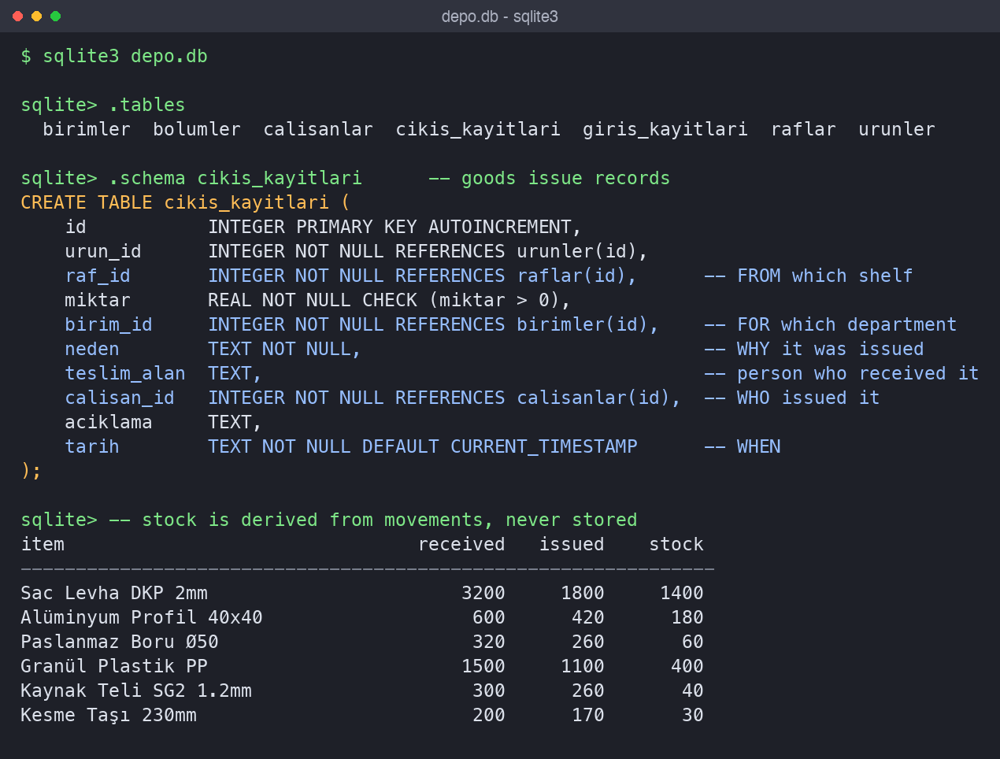
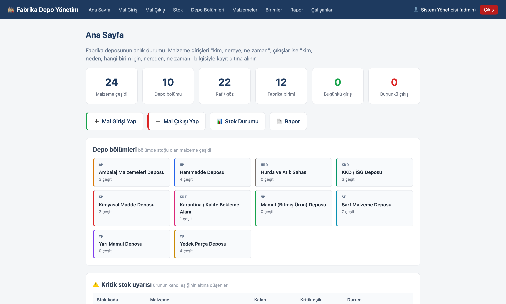
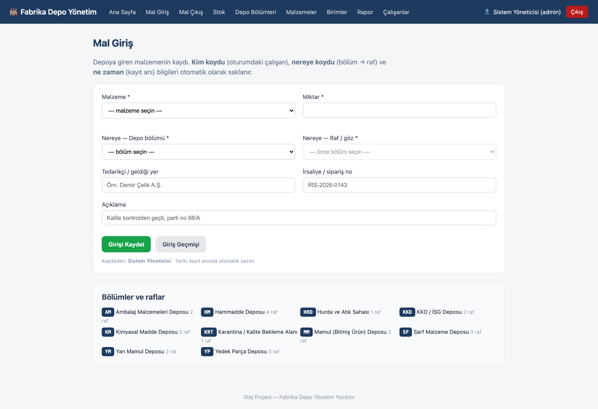

🇬🇧 **English** · [🇹🇷 Türkçe](README.tr.md)

# Warehouse Management System

A full-stack web application that replaced a paper ledger for a factory
warehouse, making every goods movement traceable end to end.

Built during a summer internship at an integrated iron and steel plant.

---

## The two questions

The whole design exists to answer these completely:

- **On receipt** — which item, by whom, to where, when?
- **On issue** — which item, by whom, **why**, for **which department**, from
  where, when?



Receipts and issues live in separate tables precisely because an issue carries
two fields a receipt does not: the reason and the requesting department.

## Design decisions worth defending

**Stock is never stored.** It is derived from the movement records on every
read. This makes a mismatch between the stock figure and the movement history
structurally impossible — a separate stock column would drift silently the
first time an update was missed.

**Stock checks are shelf-level, not item-level.** There may be 300 units of an
item in the warehouse, but if only 20 sit on that shelf you cannot take 50 from
it. Over-issue is blocked with a message stating what actually remains.

**Issue reasons come from a fixed list of nine.** Free text would produce
"production", "in production" and "PRODUCTION" as three rows and make the
breakdown meaningless.

**Cascading selection on the forms.** Section is chosen first, its shelves load
via JavaScript, then item and quantity — so nothing can be booked to a shelf in
the wrong section.

**Authorisation is enforced server-side.** Hiding a menu item is presentation,
not security; admin-only routes are guarded with a decorator.

## Screens

| Dashboard | Goods receipt |
|---|---|
|  |  |

The home page surfaces reorder alerts, per-section occupancy and recent
movements. The reporting screen breaks issues down by department and by reason,
with date filtering and **Excel export on all four screens** — the warehouse
supervisor wanted the data in his own spreadsheets.

## Stack

Python · Flask · SQLite · Jinja2 · vanilla JavaScript — no build step, no
external database server. Passwords are stored hashed; every record carries the
employee who made it.

**7 tables · 22 routes · 12 screens · 4 Excel exports**

## Running it

```bash
python -m venv venv && venv/bin/pip install -r requirements.txt
venv/bin/python seed.py     # sample factory data
venv/bin/python app.py      # → http://localhost:5001
```

Demo users are created by `seed.py`. On macOS the app listens on 5001 because
AirPlay Receiver occupies 5000; override with `DEPO_PORT`.

Interface and source comments are in Turkish; documentation is in English.
